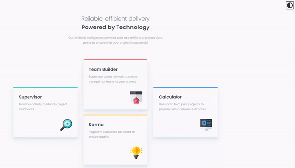

# Frontend Mentor - Four card feature section solution

This is a solution to the [Four card feature section challenge on Frontend Mentor](https://www.frontendmentor.io/challenges/four-card-feature-section-weK1eFYK). Frontend Mentor challenges help you improve your coding skills by building realistic projects. 

## Table of contents

- [Overview](#overview)
  - [The challenge](#the-challenge)
- [My process](#my-process)
  - [Built with](#built-with)
- [Author](#author)

## Overview

### The challenge

Users should be able to:

- View the optimal layout for the component depending on their device's screen size
- Toggle between Light and Dark Mode using Javascript

### Links

- Solution URL: (https://www.frontendmentor.io/solutions/four-card-feature-section-grid-sass-dark-mode-js-uA0xRDeBA0)
- Live Site URL: (https://lysitheadarkknight.github.io/FourCardFeatureSectionMaster/)

## My process

### Built with

- Semantic HTML5 markup
- SASS - Sass modules
- Grid
- Dark Mode Javascript

### Useful resources

- (https://youtu.be/0xMQfnTU6oo) Traversy Media's CSS Grid Crash Course 2022
- (https://codepen.io/sdthornton/pen/wBZdXq) Material Design Box Shadows
- (https://youtu.be/wodWDIdV9BY) Kevin Powell's How to make a website light/dark toggle with CSS & JS

## Author

- Frontend Mentor - [@LysitheaDarkKnight](https://www.frontendmentor.io/profile/@LysitheaDarkKnight)
